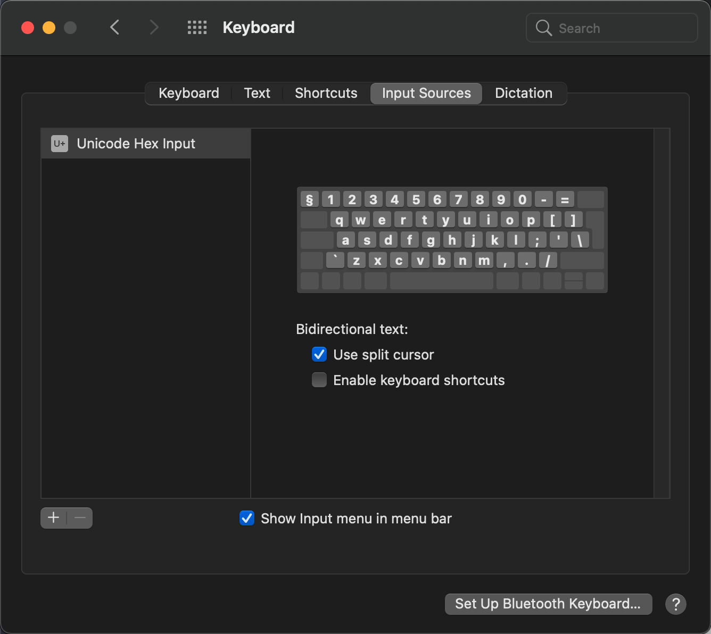

# Moonlander QWERTY Mac Layout

This is my personal QMK Mac keyboard layout for the Zsa Moonlander keyboard.
It's using standard english iso keys with the addition of the following
unicode keys:
* Å å
* Ä ä
* Ö ö
* ~ `

It's based on the source code from the [Oryx](https://www.zsa.io/oryx/) configurauion tool by Zsa.

https://configure.zsa.io/moonlander/layouts/4J93z/latest/0

The reason for this is that I wanted to retain the physical symbols on 
the keyboard and avoid a nordic keymap.

## Layout
You can view the layout here
[layout.pdf](layout.pdf)

## Important

Make sure you select 'Unicode Hex Input' as Input Source on your Mac. 

## Known Issues
<<<<<<< HEAD:qwerty/README.md
* Autoshift does not yet work on the unicode keys.

## Whats new v1.1
* Moved the arrow keys so the all sits to the right
* Moved '[' and ']' to the left keyboard
* Moved around ';' and '-' to better match the arrow layout
=======
* Autoshift does not yet work with the unicode keys.
>>>>>>> 45136ae0f07ab53c8810a26420f1ea704a41b73e:README.md
