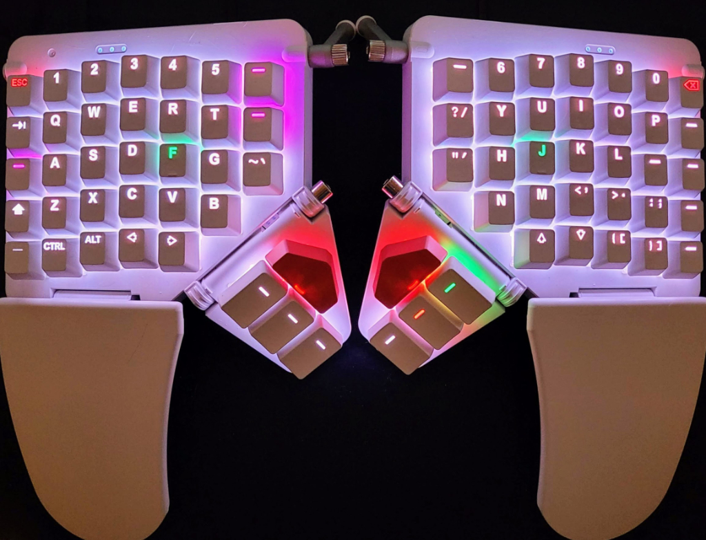
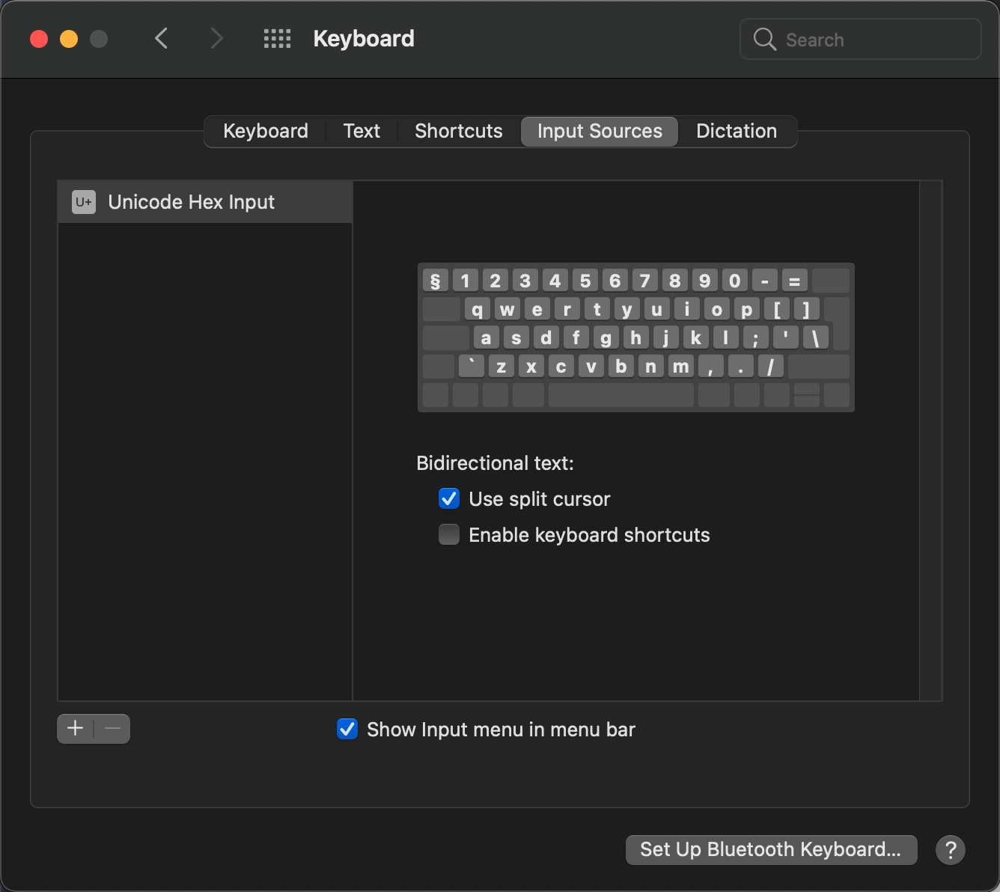

# Moonlander QWERTY Mac Layout

This is my personal keyboard layout for the Zsa Moonlander keyboard.
It's using standard english iso keys with the addition of the following
unicode keys:
* Å å
* Ä ä
* Ö ö
* ~ `

The reason for this is that I wanted to retain the physical symbols on 
the keyboard and avoid a nordic keymap.

## Important

Make sure you select 'Unicode Hex Input' as Input Source on your Mac. 

## Known Issues
* Autoshift does not yet work on the unicode keys.

## Whats new v1.1
* Moved the arrow keys so the all sits to the right
* Moved '[' and ']' to the left keyboard
* Moved around ';' and '-' to better match the arrow layout